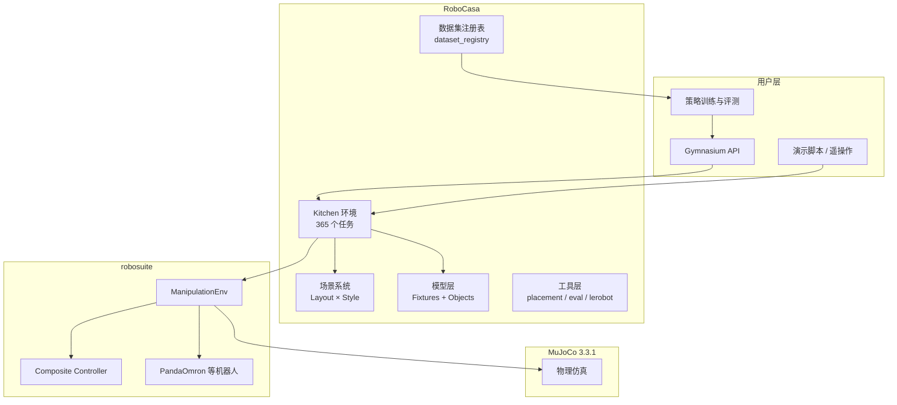

# RoboCasa 项目说明文档

## 1. 项目概述

**RoboCasa** 是由 UT Austin 研究人员开发的大规模仿真框架，用于训练和评测**通用家庭机器人**执行日常厨房任务的能力。

| 属性 | 说明 |
|------|------|
| 当前版本 | v1.0.1（RoboCasa365） |
| 物理引擎 | MuJoCo 3.3.1 |
| 底层框架 | robosuite ≥ 1.5.2 |
| Python | ≥ 3（推荐 3.11） |
| 许可证 | 代码 MIT；资产与数据集 CC BY 4.0 |
| 官方主页 | https://robocasa.ai |

**RoboCasa365** 在 2024 年初版基础上扩展，核心能力围绕四个支柱：

1. **多样化任务**：365 个厨房任务（LLM 辅助设计）
2. **多样化资产**：2500+ 厨房场景、3200+ 3D 物体
3. **高质量演示**：600+ 小时人类演示 + 1600+ 小时机器人轨迹（含 MimicGen 自动生成）
4. **Benchmark 支持**：Diffusion Policy、π、GR00T 等策略，以及官方 Leaderboard

---

## 2. 系统架构



**依赖关系**：RoboCasa 继承 robosuite 的 `ManipulationEnv`，在其上扩展厨房场景、fixtures（固定装置）、物体采样与任务逻辑，不替代 robosuite 的机器人控制与物理仿真。

---

## 3. 目录结构

```
robocasa/
├── README.md                    # 安装与快速入门
├── setup.py                     # 包配置（v1.0.1）
├── requirements.txt
├── robocasa/
│   ├── __init__.py              # 环境注册、版本校验、Gym 集成
│   ├── macros.py                # 全局宏配置
│   ├── environments/
│   │   └── kitchen/
│   │       ├── kitchen.py       # 核心基类 Kitchen
│   │       ├── atomic/          # 原子任务（~65 个）
│   │       └── composite/       # 复合任务（~300 个，按活动分类）
│   ├── models/
│   │   ├── scenes/              # 场景构建（layout/style YAML）
│   │   ├── fixtures/            # 厨房固定装置（橱柜、灶台、冰箱等）
│   │   └── objects/             # 物体定义与采样（493+ 类别）
│   ├── wrappers/
│   │   ├── gym_wrapper.py       # Gymnasium 封装
│   │   └── enclosing_wall_render_wrapper.py
│   ├── utils/
│   │   ├── dataset_registry.py    # 任务与数据集元信息
│   │   ├── env_utils.py           # 环境创建与 rollout 工具
│   │   ├── placement_samplers.py  # 物体放置采样
│   │   ├── robomimic/             # robomimic 格式转换
│   │   ├── groot_utils/           # GR00T 数据集适配
│   │   └── lerobot_utils.py       # LeRobot 格式支持
│   ├── scripts/                 # 资产下载、数据采集、数据集处理
│   └── demos/                   # 交互式演示
└── tests/                       # 环境、布局、数据集等测试
```

---

## 4. 核心模块说明

### 4.1 环境基类 `Kitchen`

所有任务继承自 `Kitchen`，它进一步继承 robosuite 的 `ManipulationEnv`：

```python
class Kitchen(ManipulationEnv, metaclass=KitchenEnvMeta):
```

**主要职责**：

- 加载并组合厨房场景（layout + style）
- 采样物体并放置到 fixtures 上
- 管理 episode 元数据（含自然语言指令 `lang`）
- 定义任务成功条件 `_check_success()`
- 支持 pretrain / target 数据划分

**环境自动注册**：通过 `KitchenEnvMeta` 元类，每个子类在定义时自动加入 `REGISTERED_KITCHEN_ENVS`，并同步注册为 Gym 环境（`robocasa/<TaskName>`）。

### 4.2 任务体系

| 类型 | 数量 | 说明 | 示例 |
|------|------|------|------|
| **Atomic（原子）** | ~65 | 单一技能，可组合 | `OpenCabinet`、`PickPlaceCounterToCabinet`、`TurnOnStove` |
| **Composite（复合）** | ~300 | 多步骤日常活动 | `ScrubBowl`、`MakeFruitBowl`、`LoadDishwasher` |
| **合计** | **365** | 官方 Benchmark 全集 | — |

**原子任务**按功能分布在 14 个模块文件中：

- 开关门/抽屉（doors, drawer）
- 抓取放置（pick_place）
- 灶台/烤箱/微波炉/水槽/咖啡机等 appliance 操作
- 导航（navigate）

**复合任务**按日常活动组织，涵盖 50+ 类别，例如：

- `washing_dishes`（洗碗）
- `setting_the_table`（摆桌）
- `baking` / `frying` / `steaming_food`（烹饪）
- `loading_fridge` / `storing_leftovers`（储存）
- `sanitizing_surface`（清洁消毒）
- 等等

### 4.3 任务实现模式

每个任务通常重写以下方法：

| 方法 | 作用 |
|------|------|
| `_setup_kitchen_references()` | 注册所需 fixtures（sink、cabinet 等） |
| `get_ep_meta()` | 生成 episode 元数据与自然语言指令 |
| `_get_obj_cfgs()` | 定义物体类型、数量与放置规则 |
| `_setup_scene()` | 初始化场景状态（如打开柜门、开水龙头） |
| `_check_success()` | 判定任务是否完成 |

**原子任务示例**（抓取放置）：

```python
class PickPlaceCounterToCabinet(PickPlace):
  def get_ep_meta(self):
      ep_meta["lang"] = f"Pick the {obj_lang} from the counter and place it in the cabinet."
      return ep_meta
```

**复合任务示例**（洗碗）：

```python
class ScrubBowl(Kitchen):
    """
  Steps:
      1. Pick up the sponge from the counter near the sink.
      2. Scrub the bowl inside the sink using the sponge.
    """
```

### 4.4 场景系统

场景由 **Layout（布局）** 与 **Style（风格）** 组合生成：

- **60 种 Layout**（LAYOUT001–LAYOUT060）：决定橱柜、岛台、水槽等空间结构
- **60 种 Style**（STYLE001–STYLE060）：决定纹理、配色、装饰风格
- 组合后可产生 **2500+ 独特厨房场景**

Layout 分组（`scene_registry.py`）：

| 分组 ID | 含义 |
|---------|------|
| -1 (TEST) | 测试集 layout（1–10） |
| -2 (TRAIN) | 训练集 layout（11–60） |
| -4 (NO_ISLAND) | 无岛台布局 |
| -5 (ISLAND) | 含岛台布局 |
| -6 (DINING) | 含用餐区布局 |

场景通过 YAML 配置 + `scene_builder.py` 程序化构建，支持 AI 生成纹理（`generative_textures="100p"`）。

### 4.5 模型层

**Fixtures（固定装置）**：继承 `Fixture` 基类，包括：

- 橱柜、抽屉、台面
- 灶台、烤箱、微波炉、冰箱、洗碗机
- 水槽、咖啡机、烤面包机、搅拌机等

**Objects（可交互物体）**：`kitchen_objects.py` 定义 **493+ 物体类别**，每个类别包含：

- 物理属性：`graspable`、`washable`、`microwaveable`、`fridgable` 等
- 来源：`objaverse`（人工设计）和/或 `aigen`（AI 生成）

### 4.6 Gymnasium 集成

所有注册环境可通过标准 Gym API 调用：

```python
import gymnasium as gym
import robocasa

env = gym.make(
    "robocasa/PickPlaceCounterToCabinet",
    split="pretrain",  # 或 "target"
    seed=0
)
```

`RoboCasaGymEnv` 提供：

- 标准化观测空间（相机 RGB、机器人状态）
- 稀疏奖励（成功 = 1.0，否则 0.0）
- 支持 PandaOmron 等机器人的 action/obs 映射

---

## 5. 数据集与 Benchmark

### 5.1 数据集注册表

`dataset_registry.py` 是数据集的核心索引，包含：

- `ATOMIC_TASK_DATASETS`：原子任务数据集路径与 horizon
- `COMPOSITE_TASK_DATASETS`：复合任务数据集路径与 horizon
- `TASK_SET_REGISTRY`：预训练/评测任务子集
- `DATASET_SOUP_REGISTRY`：混合数据集配置

### 5.2 数据划分

| Split | 用途 | 场景/物体 |
|-------|------|-----------|
| `pretrain` | 预训练 | 训练 layout/style + pretrain 物体实例 |
| `target` | 零样本/泛化评测 | 测试 layout/style + target 物体实例 |

### 5.3 数据来源

| 来源 | 说明 |
|------|------|
| `human` | 人类遥操作采集 |
| `mg` / `mg_5x5` / `mg_5x1` | MimicGen 自动生成轨迹 |
| `real` | 真实机器人数据 |

### 5.4 支持的训练框架

- **robomimic**：HDF5 格式，内置转换工具
- **LeRobot**：`lerobot==0.3.3`，含格式转换脚本
- **GR00T**：`groot_utils/` 提供 NVIDIA GR00T 数据集适配
- **tianshou**：强化学习（`tianshou==0.4.10`）

---

## 6. 主要脚本与工具

| 脚本/模块 | 功能 |
|-----------|------|
| `scripts/setup_macros.py` | 初始化系统路径与私有配置 |
| `scripts/download_kitchen_assets.py` | 下载厨房资产（约 10GB） |
| `scripts/download_datasets.py` | 下载演示数据集 |
| `scripts/collect_demos.py` | 键盘/SpaceMouse 遥操作采集 |
| `scripts/dataset_scripts/` | 数据集回放、格式转换、状态转观测 |
| `scripts/asset_scripts/` | 3D 模型导入、网格处理（VHACD/CoACD） |
| `demos/demo_tasks.py` | 任务演示回放 |
| `demos/demo_kitchen_scenes.py` | 浏览 2500+ 厨房场景 |
| `demos/demo_objects.py` | 浏览物体库 |
| `demos/demo_teleop.py` | 机器人遥操作 |

---

## 7. 安装与快速开始

### 7.1 依赖安装

```bash
# 1. 创建环境
conda create -c conda-forge -n robocasa python=3.11
conda activate robocasa

# 2. 安装 robosuite（必须使用 master 分支）
git clone https://github.com/ARISE-Initiative/robosuite
cd robosuite && pip install -e .

# 3. 安装 robocasa
cd .. && git clone https://github.com/robocasa/robocasa
cd robocasa && pip install -e .

# 4. 初始化与下载资产
python -m robocasa.scripts.setup_macros
python -m robocasa.scripts.download_kitchen_assets  # ~10GB
```

### 7.2 最小运行示例

```python
import gymnasium as gym
import robocasa
from robocasa.utils.env_utils import run_random_rollouts

env = gym.make("robocasa/PickPlaceCounterToCabinet", split="pretrain", seed=0)
run_random_rollouts(env, num_rollouts=3, num_steps=100, video_path="/tmp/test.mp4")
```

### 7.3 版本约束

导入时会强制校验（见 `robocasa/__init__.py`）：

- `mujoco == 3.3.1`
- `numpy == 2.2.5`
- `robosuite >= 1.5.2`

---

## 8. 测试体系

`tests/` 目录包含 10 个测试文件，覆盖：

| 测试 | 验证内容 |
|------|----------|
| `test_env_determinism.py` | 环境确定性（相同 seed 可复现） |
| `test_layouts.py` | 场景布局加载 |
| `test_fixtures.py` / `test_door_fixtures.py` | 固定装置行为 |
| `test_tasks_validity.py` | 任务定义合法性 |
| `test_datasets.py` / `test_dataset_playback.py` | 数据集完整性 |
| `test_env_speed.py` / `test_asset_load_speed.py` | 性能基准 |

---

## 9. 与 robosuite 的关系

工作区中同时存在 `robosuite/` 和 `robocasa/`：

| 项目 | 定位 |
|------|------|
| **robosuite** | 通用机器人操作仿真框架（MuJoCo），提供机器人、控制器、传感器 |
| **RoboCasa** | 在 robosuite 之上构建的**厨房场景 + 日常任务**专用扩展 |

RoboCasa 不 fork robosuite，而是通过 pip 依赖其 master 分支，并在 `ManipulationEnv` 上扩展厨房专用逻辑。

---

## 10. 典型使用场景

1. **模仿学习**：下载 human/mg 演示 → robomimic/LeRobot 格式 → 训练 Diffusion Policy / ACT 等
2. **零样本泛化评测**：在 `split="target"` 上测试策略对未见场景/物体的表现
3. **数据增强**：MimicGen 自动生成大量机器人轨迹
4. **遥操作数据采集**：`collect_demos.py` + SpaceMouse/键盘
5. **Leaderboard 提交**：在官方 Benchmark 上对比 GR00T、π 等基线

---

## 11. 参考资料

- 官方文档：https://robocasa.ai/docs/introduction/overview.html
- RoboCasa365 论文（ICLR 2026）：https://robocasa.ai/assets/robocasa365_iclr26.pdf
- 原始 RoboCasa 论文（RSS 2024）：https://robocasa.ai/assets/robocasa_rss24.pdf
- Leaderboard：https://robocasa.ai/leaderboard.html
- GitHub：https://github.com/robocasa/robocasa

---

## 12. 引用

**RoboCasa365：**

```bibtex
@inproceedings{robocasa365,
  title={RoboCasa365: A Large-Scale Simulation Framework for Training and Benchmarking Generalist Robots},
  author={Soroush Nasiriany and Sepehr Nasiriany and Abhiram Maddukuri and Yuke Zhu},
  booktitle={International Conference on Learning Representations (ICLR)},
  year={2026}
}
```

**RoboCasa（Original Release）：**

```bibtex
@inproceedings{robocasa2024,
  title={RoboCasa: Large-Scale Simulation of Everyday Tasks for Generalist Robots},
  author={Soroush Nasiriany and Abhiram Maddukuri and Lance Zhang and Adeet Parikh and Aaron Lo and Abhishek Joshi and Ajay Mandlekar and Yuke Zhu},
  booktitle={Robotics: Science and Systems (RSS)},
  year={2024}
}
```
